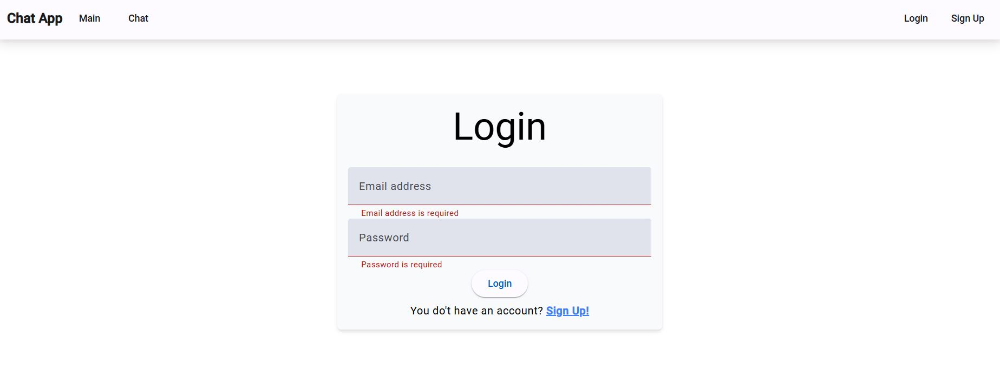

# Angular Firebase Chat Application

This project is an Angular application integrated with Firebase, providing a chat functionality with user authentication and profile management features.

## Features

- **Authentication**:
  - Users can sign up and log in securely using Firebase Authentication.
  - Redirects based on user authentication status to prevent unauthorized access.

- **User Profile**:
  - Users can update their profile information including name, email, phone, and profile picture.
  - Profile data is stored in Firebase Firestore.

- **Chat Functionality**:
  - Users can create new chats with other users.
  - Send and receive messages in real-time using Firebase Firestore for data storage.
  - View list of chats and select active chats to send messages.

## Screenshots

### Login Page


### Main Page


### Home Page (Chat)


### Profile Page


### Sign Up Page


## Technologies Used

- **Angular**: Front-end framework for building single-page applications.
- **Firebase**: Backend-as-a-Service platform providing authentication, real-time database, and cloud storage services.
- **Angular Material**: UI component library for Angular applications, providing pre-built UI components for faster development.

## Getting Started

To get a local copy up and running follow these simple steps.

### Prerequisites

- Node.js and npm installed on your development machine.
- Firebase project set up with Authentication and Firestore enabled.
- Angular CLI installed globally.

### Installation

1. Clone the repo
   ```sh
   git clone https://github.com/yarob-alrifai/angular-chat-realtime

2. Install NPM packages
   ```sh
   npm install

3. Set up Firebase credentials

- Create a Firebase project at Firebase Console.
- Enable Authentication (Email/Password) and Firestore.
- Copy Firebase configuration details (apiKey, authDomain, projectId, etc.) from Firebase Console.
- Paste the configuration details into src/environments/environment.ts and src/environments/environment.prod.ts.
4. Serve the application

   ```sh
   ng serve
5. Open your browser and navigate to http://localhost:4200/ to see the application running.

### Usage
- Authentication:
  - Sign up for a new account or log in with existing credentials.
  - Update profile information such as name, email, and profile picture.
- Chat Functionality:
  - Navigate to the "Home" page to view a list of available chats.
  - Select a chat to view and send messages in real-time.
  - Create new chats with other users by searching for their name.
- Profile Management:
  - Access the "Profile" page to update personal information and profile picture.
  - Changes are reflected in real-time and stored in Firebase Firestore.
### Contributing
Contributions are what make the open-source community such an amazing place to learn, inspire, and create. Any contributions you make are greatly appreciated.

1. Fork the Project
2. Create your Feature Branch (git checkout -b feature/AmazingFeature)
3. Commit your Changes (git commit -m 'Add some AmazingFeature')
4. Push to the Branch (git push origin feature/AmazingFeature)
5. Open a Pull Request
### License
Distributed under the MIT License. See LICENSE for more information.

### Contact
Yarob Alrifai - @yarob_alrifai - yalrifai41@gmail.com

Project Link: https://github.com/yarob-alrifai/angular-chat-realtime

### Acknowledgements
- Angular Documentation
- Firebase Documentation
- Angular Material Documentation
- Icons8 for providing icons used in the application.
